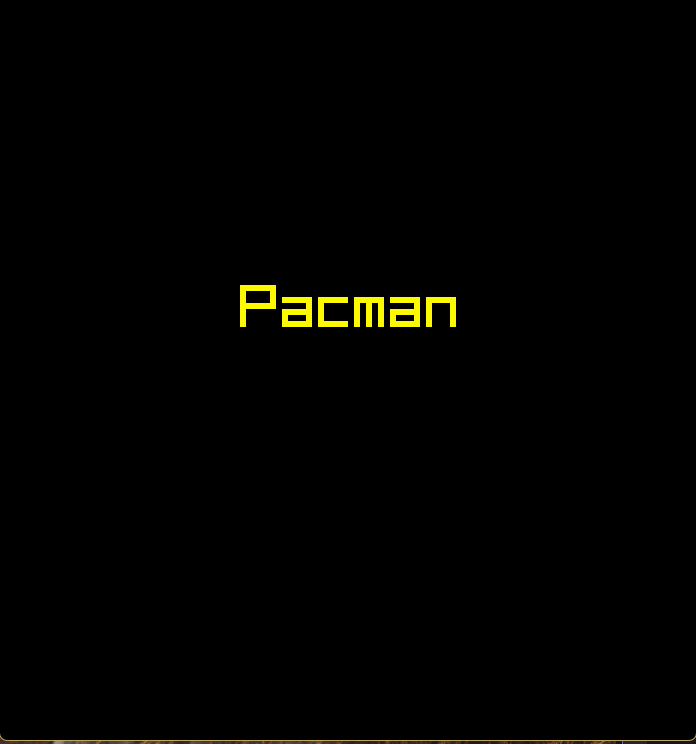

# Pacman (Raylib C#)

## Demo

A simple Pac-Man clone written in **C# using Raylib-cs**.

This project was built as a small learning project to practice: - game
loops - grid-based movement - basic enemy AI - state management - tile
maps

This project was made without the use of generative AI.

Current release: **Version 1.0**

------------------------------------------------------------------------

## Features

-   Grid-based Pac-Man movement
-   Random-moving ghosts
-   Pellet and power-pellet system
-   Score system
-   Temporary power-up mode
-   Game states:
    -   Title screen
    -   Playing
    -   Game over
    -   Win screen

------------------------------------------------------------------------

## Controls

**Arrow Keys**\
Move Pac-Man through the maze

**Enter**\
Start game / Restart after win or game over

------------------------------------------------------------------------

## Gameplay

-   Eat pellets to gain **10 points**
-   Eat **power pellets** to become powered up for **10 seconds**
-   While powered up, touching ghosts **kills them and gives 100
    points**
-   If a ghost touches you while not powered up, the game ends
-   The game is won when **all pellets are eaten**

------------------------------------------------------------------------

## Project Structure

    Program.cs
    Game.cs
    Player.cs
    Ghost.cs
    Map.cs
    Global.cs
    Enums.cs

### Program

Handles the **Raylib window and main loop**

### Game

Manages the overall game: - game states - updating player and ghosts -
win/lose conditions - menus

### Player

Handles: - player movement - pellet consumption - score - power-up timer

### Ghost

Basic enemy logic: - random movement - avoids immediate reverse
direction

### Map

Handles: - map layout - pellet storage - pellet rendering - walkable
tile detection

### Global

Stores constants such as: - tile size - map size - screen size

------------------------------------------------------------------------

## Map System

The map uses an integer grid:

    0 = wall
    1 = pellet
    2 = power pellet
    3/4/5 = one-directional paths

Pellets and power pellets are stored separately so they can be consumed
during gameplay.

------------------------------------------------------------------------

## Dependencies

-   .NET
-   Raylib-cs

Install Raylib-cs with:

    dotnet add package Raylib-cs

------------------------------------------------------------------------

## Running the Game

    dotnet run

------------------------------------------------------------------------

## Future Improvements

Possible improvements:

-   Sprite graphics instead of circles
-   Sound effects
-   Smoother movements
-   High score system
-   Replayability:
    -   Multiple levels
    -   Level editor & loader
    -   Difficulty mode using pathfinding
-   Polish In-Game UI & general UX
-   Fix overlapping not detected for objects moving in different direction

------------------------------------------------------------------------

This project is for learning purposes.
